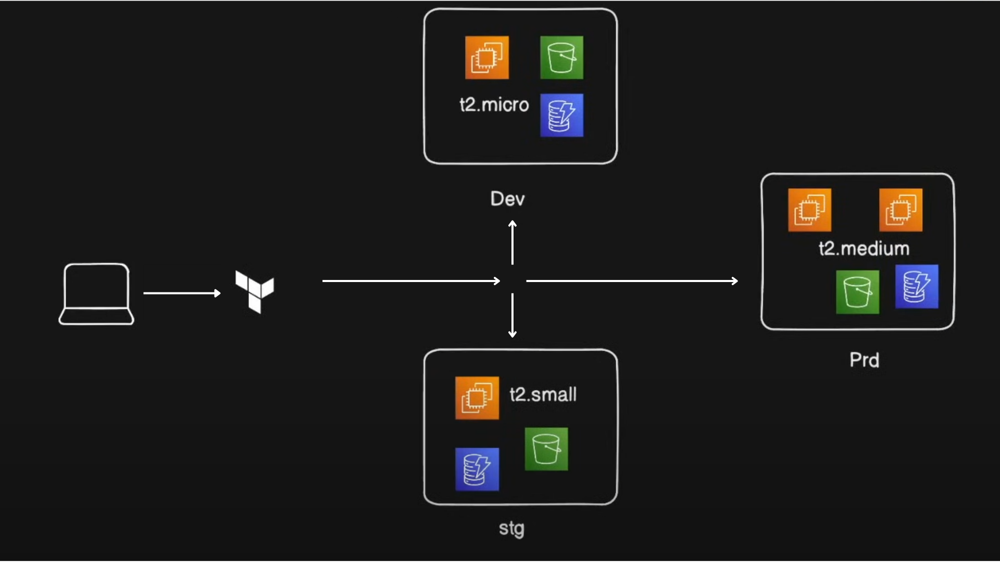

# Terraform 3-Tier AWS Infrastructure Template

Reusable Terraform template to deploy a 3-tier app infrastructure on AWS.

## 🔹 Features
- **Multi-tier EC2 Instances**: Deploy one or more EC2 instances per environment, preconfigured to run Nginx with a simple HTML page. Easily scalable for development, staging, or production environments.
- **S3 Buckets for Storage**: Automatically create S3 buckets for each environment to store application data or backups.
- **Optional DynamoDB Tables**: Enable state locking for Terraform to prevent concurrent modifications when multiple engineers work on the same infrastructure.
- **Modular Design**: The template is modularized into separate folders for EC2, S3, and DynamoDB resources, making it reusable and easy to extend for future projects.
- **Single SSH Key Pair**: Uses one SSH key pair across all environments for secure and consistent access to EC2 instances.
- **Environment-agnostic**: Can be used for development, staging, or production setups with minimal changes.
- **Infrastructure as Code**: Fully managed via Terraform, enabling version-controlled, repeatable, and auditable infrastructure deployments.


## 🏗️ Infrastructure Architecture




```text
infra-app/
│   ├── ec2/
│   ├── s3/
│   └── dynamodb/
│   └── variables.tf
├── main.tf
├── install_nginx.sh
├── main.tf
├──providers.tf
```

## 🔹 SSH Key Pair
Generate a key pair to use for all environments:

<pre> ssh-keygen -t rsa -b 2048 -f terra-key-ec2 </pre>

#Add the public key to AWS Key Pair.

Keep the private key safe; 


## ⚡ Usage
```bash
# Initialize Terraform
terraform init

# Validate configuration
terraform validate

# See planned changes
terraform plan

# Apply configuration (with optional variable overrides)
terraform apply
